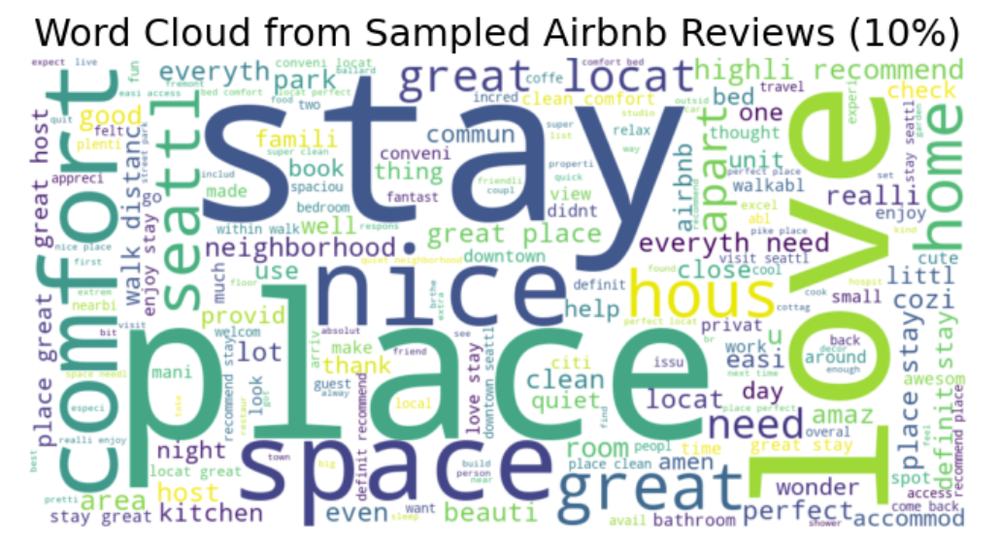
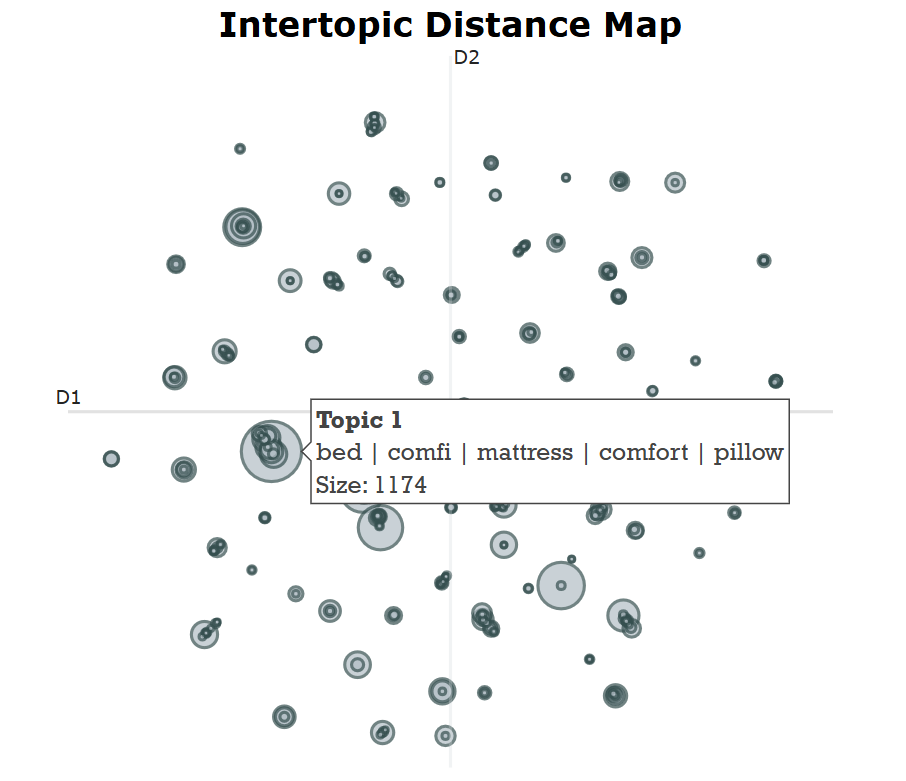

# Airbnb Review Topic Modeling – Seattle

This project analyzes customer reviews from Seattle Airbnb listings to uncover common themes using topic modeling. The goal is to help Airbnb hosts, investors, and researchers better understand what makes listings popular — and what guests value most — through both traditional and modern NLP techniques.

---

## 📊 Dataset

- **Source:** Seattle Airbnb Open Data  
- **File:** `data/sampled_reviews.csv`  
- **Details:** Contains 50,000 guest reviews with free-text comments, sampled from larger Airbnb review data.

---

## 🧠 Methods

- Text preprocessing (stopwords, stemming, cleaning)
- Exploratory Data Analysis (word frequency plots)
- Topic Modeling:
  - **TF-IDF + KMeans** for baseline clustering
  - **BERTopic** (BERT embeddings + HDBSCAN) for semantic-rich topic extraction
- Topic interpretation and visualization

---

## 🔍 Sample Visualizations

### Top Frequent Words After Cleaning

### BERTopic Topic Distance Map

---

## 🧩 Key Insights

- TF-IDF revealed mostly generic patterns (e.g. "great", "location", "clean")
- BERTopic provided more nuanced themes like responsiveness, space quality, and neighborhood charm
- Topic modeling offers actionable insights for improving listings and tailoring guest experiences

